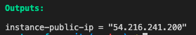
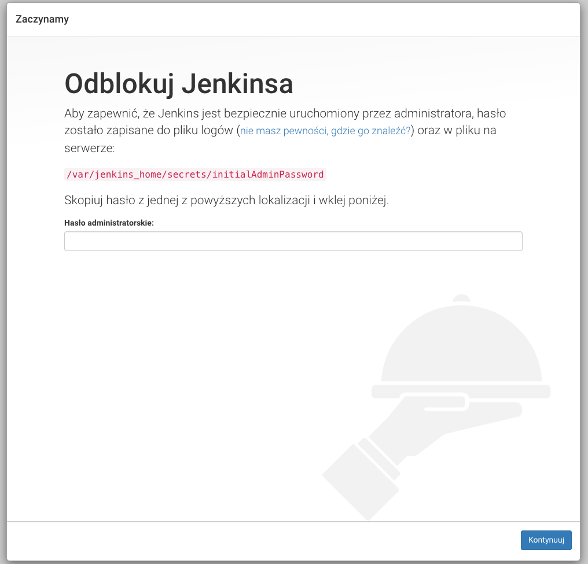

recently i started using [terraform](https://www.terraform.io/) instead of AWS [Cloudformation](https://aws.amazon.com/cloudformation/) for private projects and messing around. i find it easier to use, it's looking simpler for non-infra people, documentation is really slick and community is big. ah, and their website is freakin damn cool!

i wanted to create some simple example of terraform template, but also wanted to get my hands on technology that i don't know or just simply never worked with on daily basis.

so basically...

# deploy jenkins on ec2 with terraform

## caution: i am deploying to my default vpc and default security group is open to the world, that's why i didn't specify any sg's.
---

we will deploy ec2 that installs and starts a jenkins for us.

let's dive deep into the template
```
resource "aws_instance" "iron-test" {
  ami           = "ami-06fd78dc2f0b69910"
  instance_type = "t3.micro"
  key_name      = "iron"
}
```
first, we gonna create basic ec2 that runs ubuntu 18.04 with free tier eligible t3.micro instance type. **key_name** is key pair created in AWS.

---

then, we need to add more space on ebs volume attached to ec2

``` 
 root_block_device {
    volume_type           = "gp2"
    volume_size           = "30"
    delete_on_termination = "false"
  }
```
we are increasing size to 30 gbs which is pretty much overkill cause we basically need only to install docker, so yeah, it's up to you if u need more/less.

---

```
  provisioner "remote-exec" {
    inline = [
      "sudo apt update && sudo apt upgrade -y",
      "sudo apt install docker.io -y",
      "sudo systemctl enable --now docker",
      "sudo docker run -d -p 8080:8080 -p 50000:50000 jenkins:2.60.3"
    ]
  }

  connection {
    type        = "ssh"
    host        = self.public_ip
    user        = "ubuntu"
    private_key = file("~/.ssh/iron.pem")
  }
```

we want to install docker that will run jenkins image on ec2 and it will get exposed on port 8080. we use a provisioner called ```remote-exec``` to execute commands in order, one by one, thanks to ```inline``` parameter. **remember to specify ```-d``` parameter in docker run, otherwise terraform will get stuck in docker process.**

in the ```connection``` block we need to specify connection type, host, user and path to our **private** key, on our local machine.

---
**whole template**
```
resource "aws_instance" "iron-jenkins" {
  ami           = "ami-06fd78dc2f0b69910"
  instance_type = "t3.micro"
  key_name      = "iron"
  root_block_device {
    volume_type           = "gp2"
    volume_size           = "30"
    delete_on_termination = "false"
  }

  provisioner "remote-exec" {
    inline = [
      "sudo apt update && sudo apt upgrade -y",
      "sudo apt install docker.io -y",
      "sudo systemctl enable --now docker",
      "sudo docker run -d -p 8080:8080 -p 50000:50000 jenkins:2.60.3"
    ]
  }

  connection {
    type        = "ssh"
    host        = self.public_ip
    user        = "ubuntu"
    private_key = file("~/.ssh/iron.pem")
  }

  tags = {
    Name = "iron-jenkins"
  }

output "instance-public-ip" {
  value = aws_instance.iron-jenkins.public_ip
}

}
```
now, after we ran ```terraform apply``` we got the public ip of the instance in the outputs of terraform



copy this ip, add ```:8080``` cause that's a port that jenkins is running on and you should see a welcome page!



**additional notes**

* it's fine to use it like this for testing, but in more serious environments you probably shoud add docker volume to jenkins to not lose data
* if your jenkins cannot pull plugins, check if you got correctly configured security group
* same if you cannot access the page
