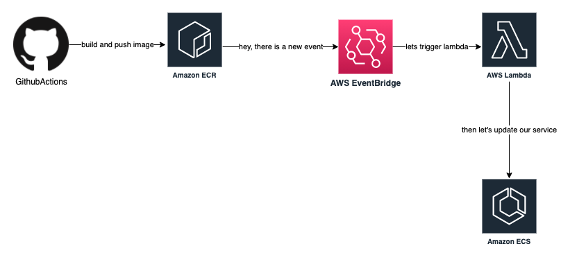
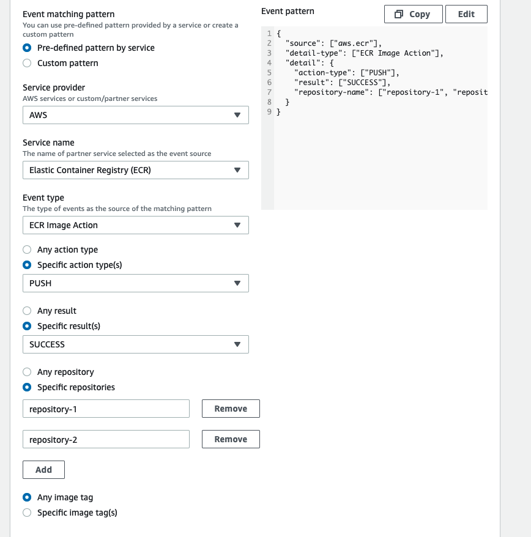
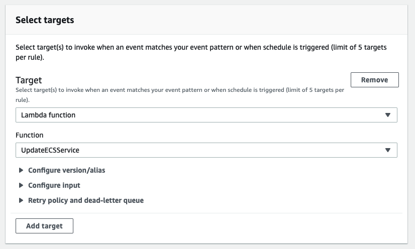

sometime ago i was wondering how to get rid of some really old bash scripts that we were using to update ecs service.
i had an idea to use [AWS Lambda](https://aws.amazon.com/lambda/) along with [AWS EventBridge](https://aws.amazon.com/eventbridge/).

basically i wanted to trigger lambda everytime a new docker image was pushed to [ECR](https://aws.amazon.com/ecr/) and that function would update a service with new image. simply put, a new task definition would be created with that new image.

maybe some diagram will help to understand it a little bit better


---
**lambda code**
```
import boto3

client = boto3.client('ecs')

def lambda_handler(event, context):
    repo_name = event.get("detail").get("repository-name")
    format_repo_name = ''.join(repo_name)    
    client.update_service(
    cluster='name of our cluster',
    service=format_repo_name,
    forceNewDeployment=True
    )
```

super simple stuff, we are using [boto3 ecs client update](https://boto3.amazonaws.com/v1/documentation/api/latest/reference/services/ecs.html#ECS.Client.update_service)

we need to provide the name of our cluster and service. we also force new deployment so we are sure that new task will be created.

i also wanted to make lambda more universal so i am retrieving a repository name from the eventBridge event and i pass it to service parameter. CAUTION: **it will only work if your service name is the same as the name of the ECR repository**

we also need to create a rule in the EventBridge. we simply need to go to AWS EventBridge console and click create rule.
then, there are a few things that are important for us -->

we select an event pattern and then we need to configure our pattern


* service provider - AWS
* service name - ECR
* event type - ecr image action
* specific action - push, as we want to trigger lambda only on push
* specific result - success, as we don't want to trigger lambda if push to ECR fails
* specific repositories - we select which services EventBridge will observe

this whole configuration can be also done with

```
{
  "source": ["aws.ecr"],
  "detail-type": ["ECR Image Action"],
  "detail": {
    "action-type": ["PUSH"],
    "result": ["SUCCESS"],
    "repository-name": ["repository-1", "repository-2"]
  }
}
```

then we want to select our lambda as a target for an event 

and that's basically it. you can test it by pushing new image to ECR.

conclusions:

* imo much elegant and easier way to manage updates then some bash/python scripts
* it works if your ECS task is using :latest image which is not generally good idea in production envs
* devs don't see update progress in a pipeline - they only see that image was pushed to ECR. they would need to check out AWS console or use AWS CLI. that could be mitigated a little bit by sending notification by lambda to Slack channel for example
* won't work if ECS service name is not the same as name of ECR repo
